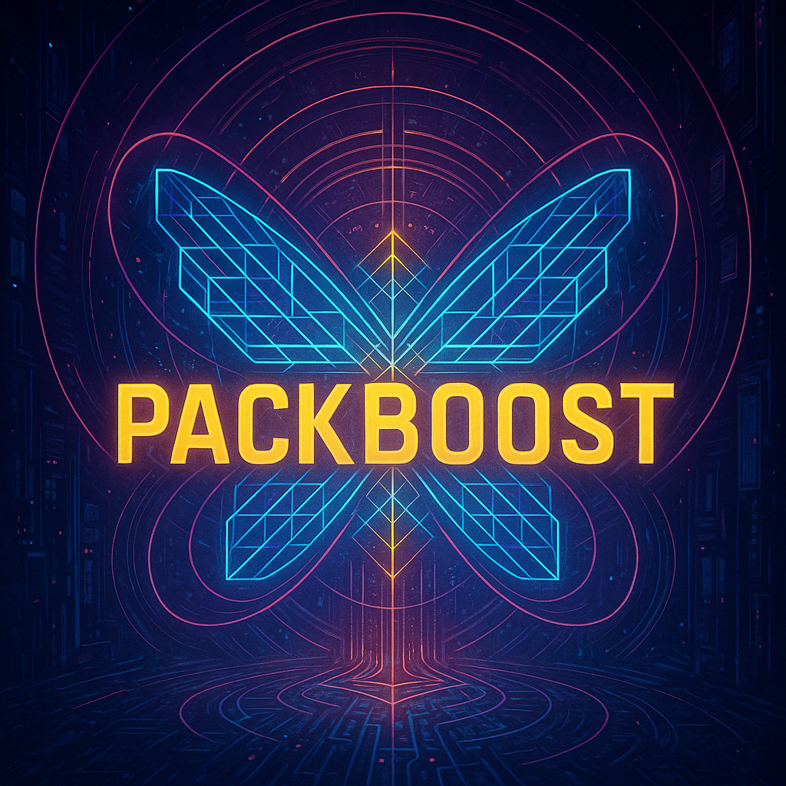

# PackBoost



> This repo is a work in progress...

> GPU-accelerated gradient boosting **in the style of Murky’s ExtraFastBooster (EFB)** with clean CPU fallbacks, strict CPU⇄CUDA parity tests, and targeted warp-level optimizations (e.g., butterfly transpose / scatter-reduce).

---

## TL;DR

* **Core pipeline**: `encode_cuts → et_sample_1b → prep_vars → H0 → repack` (H next).
* **Parity first** (Murky semantics), **optimize second** (only where it pays).
* **Strict tests**: every kernel has a vectorized Torch CPU reference and pytest parity.

---

## Current Benchmarks

### `et_sample_1b`

* **Butterfly:** **0.621 ms**
* **Shared-memory (SM):** **0.990 ms**

### `H0` *(K=8, D=7, N=2,700,000, nodes=128)*

* **SM baseline:** **3.225 ms** → ~**46.88 M** accumulations/s | H0 size ~0.000 GB
* **Butterfly-optimized:** **1.657 ms** → ~**91.24 M** accumulations/s | H0 size ~0.000 GB

> Notes: means over many iterations after warm-up; contiguous inputs; leaf plane is zero by construction.

---

## Phases & Roadmap

### Phase 0 — Learn **ExtraFastBooster**

*(encode_cuts, et_sample_1b, prep_vars, repack, H0, H)*

* Re-derive EFB dataflow & shapes.
* Triangular bit-packing by depth: `T(d)=d(d−1)/2`, `mask(d)=((1<<d)−1)<<T(d)`.
* Understand each kernel’s purpose & invariants (encode_cuts, et_sample_1b, prep_vars, repack, H0, H).
* Warp-level primitives (shuffles, butterfly), coalesced access patterns, profiling discipline.

### Phase 1 — Implement **EFB** (+ Optimizations)

*(encode_cuts, et_sample_1b, prep_vars, repack, H0, H)*

* Implement Murky-parity CUDA kernels & launchers.
* Write Torch CPU references (vectorized) for each op.
* Tests: randomized shapes, tail handling, dtype branches.
* Optimize selectively (butterfly variants where memory traffic dominates).

#### Phase-1 Workflow (per kernel)

**understand → implement Murky’s kernel → implement Murky’s launcher → Torch CPU version → write tests → run tests → reason about optimizations → implement optimizations → test & profile**

### Phase 2 — Cut, Advance, Predict

* Understand & implement `cut_cuda`, `advance`, `predict`.
* Follow the Phase-1 workflow end-to-end.

### Milestones

* **Milestone-1:** Numerai profiling vs **ExtraFastBooster** (throughput & wall-clock).
* **Milestone-2:** Understand **DES** → implement **DES** integration in PackBoost (Z-axis / era stratification).

---

## Execution Checklist

### Global

* [x] **Phase 0**: Learn EFB modules *(encode_cuts, et_sample_1b, prep_vars, repack, H0, H)*
* [ ] **Phase 1**: Implement all kernels + optimizations *(H pending)*
* [ ] **Phase 2**: Implement `cut_cuda`, `advance`, `predict`
* **Milestones**

  * [ ] **M1** Numerai profiling vs EFB
  * [ ] **M2** Understand & implement DES in PackBoost

### Kernel-by-Kernel (Phase-1 workflow applied)

* **encode_cuts**

  * [x] Understand
  * [x] Murky kernel (SM baseline) & launcher
  * [x] Torch CPU reference (vectorized)
  * [x] Tests (CPU≡GPU)
  * [x] Run tests (passing)
  * [x] Reason optimizations (pragma-unroll / access ordering)
  * [ ] Implement extra optimizations (butterfly if ROI)
  * [x] Test & profile baseline

* **et_sample_1b**

  * [x] Understand
  * [x] Murky kernel (SM baseline) & launcher
  * [x] Torch CPU reference
  * [x] Tests (passing)
  * [x] Implement **butterfly** variant
  * [x] Test & profile (**0.621 ms vs 0.990 ms**)

* **prep_vars**

  * [x] Understand
  * [x] Murky kernel & launcher
  * [x] Torch CPU reference (bit-pack `LE`, quantize `G`)
  * [x] Tests (dtype branches u16/u32/u64)
  * [x] Run tests (passing)
  * [x] Micro-opts as needed
  * [x] Test & profile

* **H0**

  * [x] Understand
  * [x] Murky kernel (SM baseline) & launcher
  * [x] Torch CPU reference (scatter_add)
  * [x] Tests (leaf plane zero, shapes)
  * [x] Implement **butterfly-optimized** variant
  * [x] Test & profile (**1.657 ms vs 3.225 ms**)

* **repack** (LE→LF via FST)

  * [x] Understand
  * [x] Murky-parity CUDA kernel (8×32 tiling) & launcher
  * [x] Torch CPU reference (safe 64-bit mask build)
  * [x] Tests (tails on `N`, `nfeatsets`)
  * [x] Run tests (passing)
  * [x] Reason optimizations (mask precompute, FST folding)
  * [ ] Implement optional FST folding / mask precompute
  * [x] Test & profile baseline

* **H** (post-repack histograms)

  * [x] Understand
  * [ ] Murky kernel & launcher
  * [ ] Torch CPU reference
  * [ ] Tests
  * [ ] Run tests
  * [ ] Reason optimizations (butterfly scatter-reduce)
  * [ ] Implement optimizations
  * [ ] Test & profile


---

## Core API (excerpt)

```python
class PackBoost(BaseEstimator, RegressorMixin):
    def __init__(self, device='cuda'): ...
    def encode_cuts(self, X: torch.Tensor) -> torch.Tensor: ...
    def et_sample_1b(self, X: torch.Tensor, Fsch: torch.Tensor, round: int) -> torch.Tensor: ...
    def prep_vars(self, L: torch.Tensor, Y: torch.Tensor, P: torch.Tensor): ...
    def h0(self, G: torch.Tensor, LE: torch.Tensor, max_depth: int) -> torch.Tensor: ...
    def repack(self, FST: torch.Tensor, LE: torch.Tensor, tree_set: int) -> torch.Tensor: ...
```

**Key shapes**

* `encode_cuts`: `X [N,F] → XB [4F,M]` (32-sample bitplanes per feature & threshold).
* `et_sample_1b`: `X [bF,M]`, `Fsch [rounds, 32*nfeatsets]` → `XS [nfeatsets, 32*M]`.
* `prep_vars`: `L [K,Dm,N] → LE [K,N] (u16/u32/u64)` with triangular packing; `Y,P [N] → G [N] (int16)`.
* `h0`: `G [N], LE [K,N], D → H0 [K, 2^D, 2] (sum,count)`.
* `repack`: `FST [nsets,nfeatsets,D], LE [K,N] → LF [nfeatsets,N]`.

**Triangular packing refresher**

```
offset T(d) = d(d-1)/2
mask(d)     = ((1<<d) - 1) << T(d)
```

`LE` stores path bits per tree; `repack` uses `FST[round, fs, d]` to remix depth-slices into the feature-set view and OR them together.

---

## Build & Tests

### Build the CUDA extension

```bash
pip install -r ninja torch numpy scikit-learn
```

### Run tests

```bash
pytest -q tests/test_cuda_kernels.py
```

Included:

* `test_encode_cuts_matches_cpu_reference`
* `test_et_sample_1b_matches_cpu_reference`
* `test_prep_vars_matches_cpu_reference`
* `test_h0_matches_cpu_reference`
* `test_repack_matches_cpu_reference`

---

## Engineering Notes

* **Butterfly vs SM:** use butterfly where it reduces SMEM traffic or atomics; keep SM baseline for parity & fallback.
* **Dtypes:** `LE/LF` use `u16/u32/u64` depending on depth; build masks in `int64`, then cast down.
* **Tiling:** `repack` uses **8** feature-sets per block and **32** lanes per warp; inner `stride` walks `N`.
* **FST layout:** `[nsets, nfeatsets, D]`; select via `FST[round, fs, d]`.
* **Invariants:** H0 leaf plane zero; LF dtype==LE dtype; `.contiguous()` before CUDA calls.

---

## Attribution

Inspired by **Murky’s ExtraFastBooster** dataflow and **Timothy DeLise's Directional Era Splitting**. PackBoost is a clean-room implementation with CPU⇄CUDA parity tests and targeted GPU optimizations.
